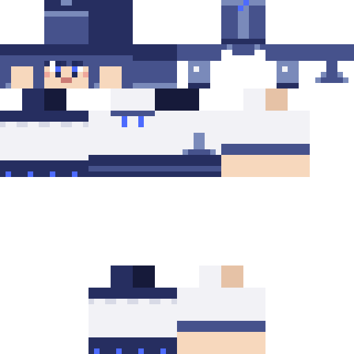
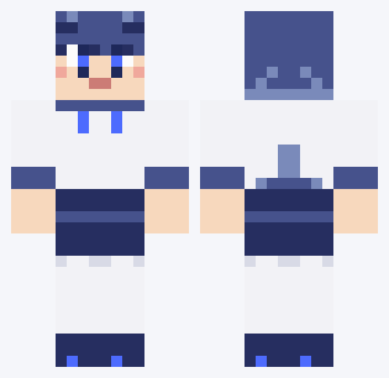

# 露娜 · 鲸鱼娘 AI 助手（deepseek mod）



一个 Minecraft **1.19.2 / Forge** 模组：把「鲸鱼娘 AI 助手 · 露娜」带到你的世界里。
她会陪你聊天、听你指挥盖房子、整理箱子、钓鱼种田，喂她鱼还会永久加血。



> 源自个人实训项目，持续开发中。皮肤立绘归属见 [CREDITS-皮肤署名.md](dist/CREDITS-皮肤署名.md)（非商业授权）。

## 功能一览

| 系统 | 说明 |
|---|---|
| 🗣 AI 对话 | 在她 12 格内直接打字聊天；接 **智谱 GLM** API（`glm-4-flash` 免费），不配 Key 走离线关键词模式，指令照样能用 |
| 🏠 建造系统 | 说「帮我盖个小木屋」→ 她列材料清单 → 你给料 → 她发你一根「建筑定位火把」，**插在哪盖在哪**，一块一块走过去搭；内置 229 张图纸（剑与王国转换 203 + 手绘 26），支持语义匹配和「换图纸」 |
| 🧪 自带合成 | 只吃原始材料：给橡木原木她自己合成木板木棍，给圆石自己合成石墙 |
| 🎒 随身背包 | Shift+右键打开 54 格背包；交付/多余材料都由她保管 |
| 📦 整理箱子 | 「整理箱子」→ 走到最近的箱子合并堆叠、分类排序 |
| 🎣 钓鱼 / 🌾 种地 | 喊她钓鱼、种地收菜 |
| 🐟 喂鱼加血 | 拿鱼右键喂她：**每条鱼 +1 颗永久额外生命**（吸收心），上限无限制；装了 [Jade](https://www.curseforge.com/minecraft/mc-mods/jade) 后准星指她会看到红心后面的**黄色爱心** |
| 😴 表现系统 | 发呆会鸭子坐打盹（头顶飘 ZZZ）、被打会哭着狂跑、建造时挥手敲方块、远归欢迎、好奇捡东西 |
| ⚪ 精灵球 | 合成精灵球，右键收回/放出她 |

## 安装

1. 从 [Releases](../../releases) 下载 `deepseek-0.1.0.jar`（或自己构建，见下文）
2. 放进 `.minecraft` 实例的 `mods` 文件夹（单人/服务端都要放）
3. 进游戏：创造物品栏拿「AI伙伴 生成蛋」右键地面，或管理员指令 `/companion spawn`

## 使用

**聊天栏直接说话**（在她 12 格内）：

| 你说 | 她做 |
|---|---|
| 跟着我 / 在这停下 / 随便逛逛 | 切换跟随模式（也可 Shift+空手右键循环切换） |
| 帮我盖个小木屋 / 瞭望塔 / 篝火营地 | 报材料清单 → 收料 → 发定位火把 → 开工 |
| 换个图纸 | 材料不满意时换一张图纸 |
| 整理箱子 / 钓鱼 / 种地 | 执行对应任务 |
| 你状态怎么样 | 汇报血量、模式、保管材料 |
| 其他随便聊 | AI 接话（需配 Key），离线模式会卖萌兜底 |

**给她材料**：拿在手上对她右键，或丢在她脚边她自己捡。
**定位火把**：插在哪，房子以它为中心盖；被破坏立刻停工，对她说「火把」再要一根。

### 接入 AI（可选，推荐）

不配 Key 也能玩全部指令，只是不会自由聊天。

1. 打开 <https://open.bigmodel.cn> 注册并新建一个 API Key（`glm-4-flash` 免费）
2. 编辑 `config/deepseek-common.toml`：`apiKey = "你的key"`
3. 重启游戏；`model`、`apiUrl` 也在这里改（兼容任何 OpenAI 兼容接口）

详细图解：[README-API申请.md](dist/README-API申请.md)。
她还能回答整合包问题——把 `dist/knowledge/modpack-overview.md` 放进 `config/deepseek/knowledge/`，也欢迎加自己的笔记（.md/.txt，热加载）。

### 可选依赖

- **Jade**（WAILA 类模组）：装了它，准星指着露娜时详细信息框里会显示红色血量爱心 + 黄色的额外生命爱心。不装不影响其他功能。

## 自己构建

环境：JDK 17。项目自带 Gradle Wrapper（7.5.1）：

```bash
./gradlew build        # Windows: gradlew.bat build
```

产物在 `build/libs/deepseek-0.1.0.jar`。
`libs/Jade-1.19.1-forge-8.9.2.jar` 是编译期依赖（黄心插件用），已随仓库附带；Jade 为 MIT 协议，源码见上游仓库。

## 项目结构

```
src/main/java/dev/elena/deepseek/
├── ai/        # GLM API 对话、离线关键词、知识库、配置
├── client/    # 渲染：玩家模型+鲸尾+鲸鳍侧耳、睡觉 ZZZ、受击流泪
├── entity/    # CompanionEntity：状态机、交互、喂鱼加血、任务调度
├── task/      # 建造、合成、整理、钓鱼、种田、好奇心、图纸与材料替代
├── item/      # 精灵球、建筑定位火把
└── compat/    # Jade 插件（详细信息框黄心）
tools/         # 皮肤/耳朵贴图生成脚本、图纸转换等开发工具
dist/          # 发布说明、知识库样例、皮肤预览图
```

## 鸣谢与授权

- **鲸鱼娘角色**：原画 [上善无形](https://www.pixiv.net/users/)（一创）、DeepSeek 二创 [ZipZipPipe](https://www.pixiv.net/users/)
- 皮肤为参照配色独立重绘的像素画，**非商业授权**，详见 [CREDITS-皮肤署名.md](dist/CREDITS-皮肤署名.md)
- 代码以 [MIT](LICENSE) 协议发布
